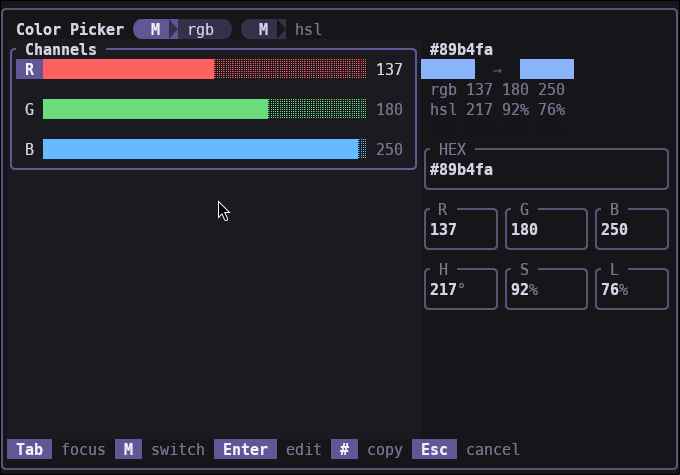
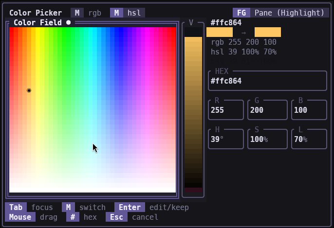

# ratatui-color-picker

An interactive terminal color picker for [ratatui](https://ratatui.rs).

`ColorEditor` is a self-contained, render-agnostic state machine for editing a single
color. It keeps **RGB**, **HSL**, and **HSV** in sync, manages keyboard focus / tab order,
supports inline numeric and hex text editing with validation, and does mouse hit-testing
against a computed layout. You drive it from your event loop and draw it however you like.

> Extracted from a real Zellij theme editor, where it's the daily-driver color picker.

### RGB sliders



### HSL field



## Why

The TUI color-picker space is thin. The handful of existing crates are either pure color
*conversion* libraries (e.g. [`coolor`](https://crates.io/crates/coolor)) or a basic RGB
color *wheel*. This one is a full editor:

- **Two modes** — three **RGB sliders**, or a 2-D **HSL field + lightness slider**
- **Hex input** — type `#rrggbb` directly
- **Inline numeric editing** — edit any R/G/B or H/S/L channel as text, with validation
  and range clamping
- **Hue preservation** — desaturating toward grey doesn't lose your hue
- **Keyboard** — full tab order across every control
- **Mouse** — click-to-focus and drag, via `focus_for_point` hit-testing
- **Render-agnostic** — the crate owns the model + layout; you own the pixels

## Install

```toml
[dependencies]
ratatui-color-picker = "0.1"
```

## Usage

```rust
use ratatui_color_picker::{ColorEditor, ColorPickerFocus, picker_layout};

// Seed from an existing color (anything Into<RgbColor>: [u8; 3] or RgbColor).
let mut editor = ColorEditor::from_color([0x89, 0xb4, 0xfa]);

// --- in your event loop, translate input into editor calls ---
editor.focus_next(false);          // Tab — move focus across controls
editor.adjust_focused_numeric(5.0); // ↑ on the focused channel
editor.start_editing_focused();    // begin typing into the focused text field
// editor.push_input_char('a'); editor.commit_text_edit();

// --- when drawing, compute the layout for your overlay Rect ---
// let rects = picker_layout(overlay_rect, editor.mode);
// ... render using rects + editor state ...

// --- read the result ---
let rgb = editor.to_rgb();
let style_color: ratatui::style::Color = rgb.into();
println!("{}", editor.hex()); // "#89b4fa"
```

`ColorEditor` exposes everything you need to wire keyboard and mouse input:
`focus_next`, `move_rgb_slider_focus`, `adjust_focused_numeric`, `adjust_rgb_slider_selection`,
`toggle_mode`, `nudge_hsl_field`, `update_from_hsl_field`, `update_lightness_from_frac`,
`start_hex_input` / `start_editing_focused` / `push_input_char` / `pop_input_char` /
`commit_text_edit` / `cancel_text_edit`, and `focus_for_point` for mouse hit-testing.

### Drawing it

A ready-made `StatefulWidget` draws the whole picker; the state is your `ColorEditor`:

```rust
use ratatui_color_picker::{ColorPicker, PickerTheme};

// in your draw closure:
frame.render_stateful_widget(
    ColorPicker::new().original(Some(starting_color)), // optional before→after swatch
    overlay_area,
    &mut editor,
);
```

Theme it by passing a `PickerTheme` to `.theme(...)` — `PickerTheme::default()` matches the
look shipped here. Prefer to draw it yourself? The same `picker_layout`, `split_three`,
`hsv_field_cell`, `contrast_text`, `srgb_f32`, and `normalize_hue` helpers are public.

### Demo

Clone the repo and run the bundled example:

```sh
git clone https://github.com/allisonhere/ratatui-color-picker
cd ratatui-color-picker
cargo run --example demo
```

Tab/Shift-Tab move focus, `M` toggles RGB/HSL, arrows nudge (in the HSL field ←→ change hue
and ↑↓ change saturation). Tab to a text field (HEX / R,G,B / H,S,L) and press **Enter** to edit
it — type a value, **Enter** commits, **Esc** cancels. `#` copies the current hex to the
clipboard, `q` quits (and prints the picked color). **Mouse** works too — click a control to
focus it, and click/drag the RGB sliders, the HSL field, or the lightness slider to set a value.

## Status

`0.1` ships the color model, layout, hit-testing, **and a themable `StatefulWidget`**, with
full keyboard **and** mouse support demonstrated in `examples/demo.rs`. Contributions welcome.

## License

MIT
